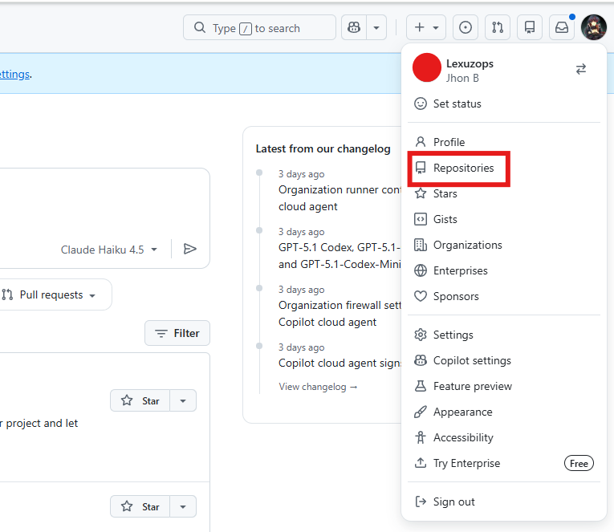
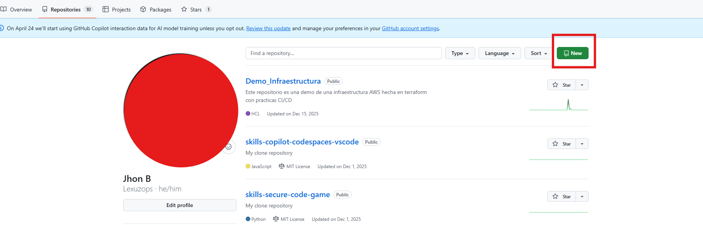
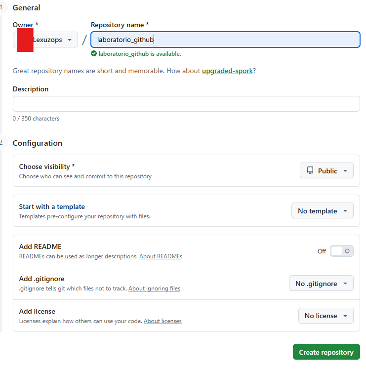
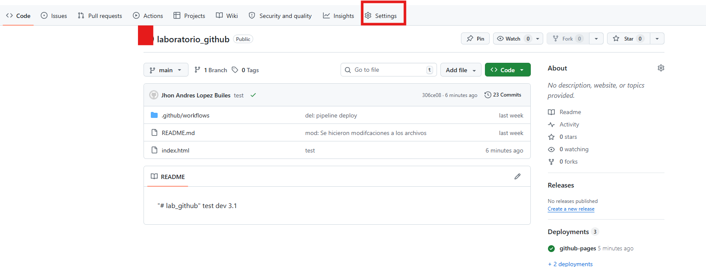
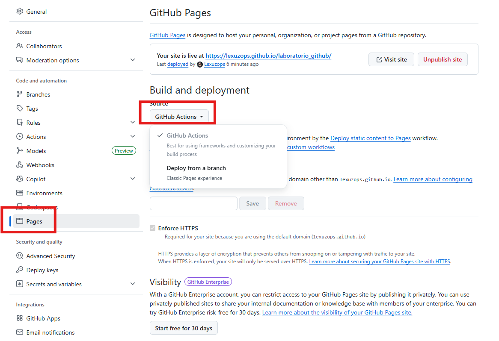

# 🚀 Introducción

Este laboratorio está diseñado como una introducción práctica a Git, una herramienta fundamental para el control de versiones en el desarrollo de software. A lo largo de este ejercicio, aprenderás los conceptos básicos para gestionar código, crear y trabajar con repositorios, realizar commits y colaborar mediante ramas.

El objetivo es brindar una base sólida que te permita comenzar a trabajar con flujos de desarrollo modernos y comprender cómo se gestionan los cambios en proyectos reales

# 📙 Instrucciones
#### Como requerimientos previos se necesita tener instalado git en tu pc y visual studio code para poder editar el archivo index.html.
Esta guia de laboratorio solo explicara ejecucion de comandos mediante CLI.


## 1. Creación de un repositorio.

- Cuando se este logueado en github ir a Perfil -> Repositories.

- Seleccionar New

- Se desplegara el siguiente menu para poder crear el repositorio, Poner como nombre del repositorio laboratorio_github y crearlo


## 2. Descarga de archivos para laboratorio en tu propio repo.

En este caso no se usara la funcion Fork de git para evitar posibles conflictos con el repositorio principal por algun PR.

Ubicate en la carpeta o sitio donde quieres clonar el repositorio que creaste, abre la ventana de comandos o terminal de tu preferencia y ejecuta los siguientes comandos:
```bash
  git clone https://github.com/mnarvaezm96/lab_github.git
  cd lab_github
  git remote remove origin
```
### IMPORTANTE
Para ejecutar el siguiente comando se tiene que cambiar "tu-usuario" por el nombre de tu usuario github. 
```bash
  git remote add origin https://github.com/tu-usuario/laboratorio_github.git
  git push -u origin main
```
Luego de ejecutado los comandos se puede verificar en github que ya se han agregado archivos.

## 3. Configuracion de pagina estatica para el laboratorio.

Para este laboratorio se requiere habilitar una configuracion en el repositorio que me permita revisar los cambios en el archivo de index.html en el navegador web de forma publica, para esto seguir los siguientes pasos:
- Dirigirse a Settings desde el repositorio. 
- Seleccionar la seccion de Pages y en Build and deployment desplegar la barra y seleccionar GitHub Actions. 

Ya con las configuraciones realizadas se puede a proceder con ejecucion de comandos git para el laboratorio.

## 4. Creación de ramas con git.

Para crear un rama en con git se debe estar primero ubicado en la rama a la que quieres aplicar modificaciones, en este caso solo esta creada la rama main por lo que crearemos la rama "dev"

Para verificar en que rama se esta ubicado mediante la CLI se ejecuta el comando
```bash
    git branch
```
para checar que ramas remotas tiene el repositorio en github se utiliza
```bash
    git branch --all
```
Este comando es util para saber si el repositorio en internet tiene mas ramas y no las puedes evidenciar en el repositorio clonado localmente.

Una vez corroboramos que estamos en la rama main podemos crear la rama dev con el comando:

```bash
    git switch -c dev
```
cuando se ejecute este comando se puede corroborar con los comandos anteriores que ya se cuenta con la rama creada localmente, pero no esta aun creada en el repostorio alojado en internet, para poder crear esta rama en el repositorio alojado en internet se ejecuta el siguiente comando:
```bash
    git push origin dev
```
Como se puede apreciar cuando se va a hacer push hacia el repostorio en internet se especifica "origin <nombre-de-la-rama>".

### Ahora puedes modificar el codigo en la rama de desarrollo sin afectar la rama de produccion (main)

